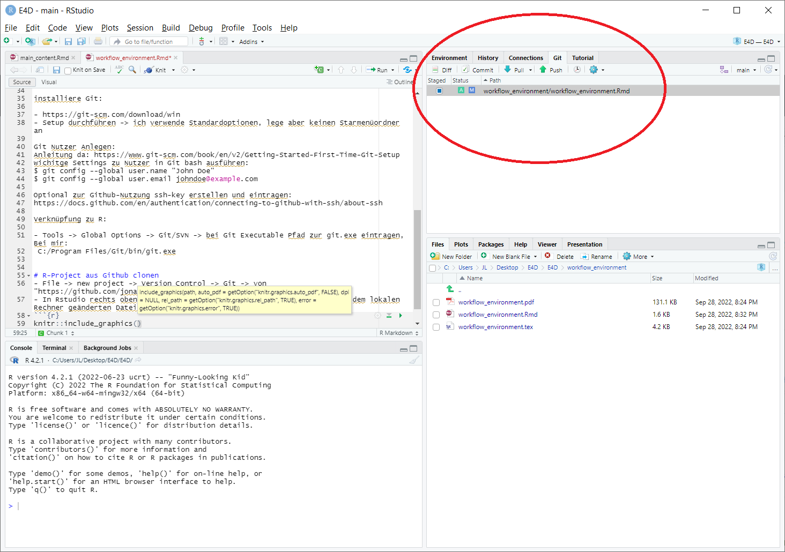

# RMD-Setup

Installiere:

- R
- Rstudio
R-packages:
```
 install.packages("bookdown")
 tinytex::install_tinytex()
 install.packages("rticles")
 install.packages("rmarkdown")
```

# Test Rmd-Paper erstellen
```
rmarkdown::draft(file = "MyArticle.Rmd",
                 template = "copernicus",
                 package = "rticles", edit = FALSE)

rmarkdown::render(input = "MyArticle/MyArticle.Rmd")
```
--> Das erste mal dauert es ewig, weil tinytex die benötigten Tex-Packete nachlädt, danach geht es schneller

# Git-Setup

installiere Git:

- https://git-scm.com/download/win
- Setup durchführen -> ich verwende Standardoptionen, lege aber keinen Starmenüordner an

Git Nutzer Anlegen:
Anleitung da: https://www.git-scm.com/book/en/v2/Getting-Started-First-Time-Git-Setup
wichitge Settings zu Nutzer in Git bash ausführen:
$ git config --global user.name "John Doe"
$ git config --global user.email johndoe@example.com

Optional zur Github-Nutzung ssh-key erstellen und eintragen:
https://docs.github.com/en/authentication/connecting-to-github-with-ssh/about-ssh

Verknüpfung zu R:

- Tools -> Global Options -> Git/SVN -> bei Git Executable Pfad zur git.exe eintragen, Bei mir:
 C:/Program Files/Git/bin/git.exe


# R-Project aus Github clonen
- File -> new project -> Version Control -> Git -> von "https://github.com/jonaslenz/E4D.git" clonen 
- In Rstudio rechts oben erscheint Git-Reiter -> darin sieht man alle auf dem lokalen Rechner geänderten Dateien, die durch Git getrackt werden.
```{r}

```

